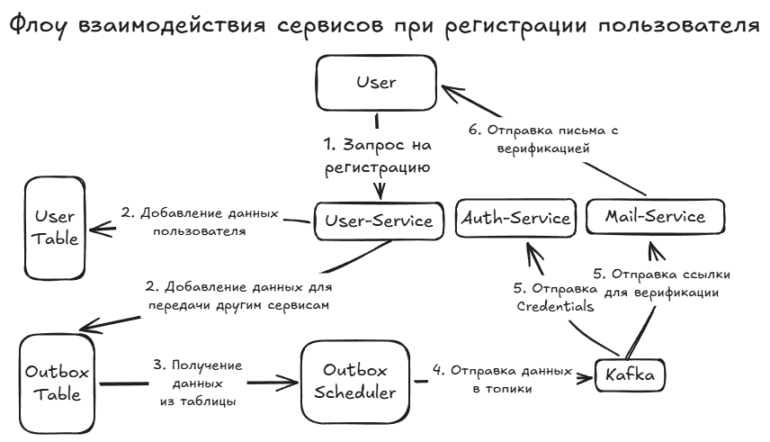

# Microservices app example


## Описание проекта

### Пользовательское описание

Простое микросервисное приложение с регистрацией и авторизацией пользователя и возможностью получить им собственный профиль.

### Техническое описание

- **Язык:** Java 17
- **Фреймворк:** Spring Boot (API, авторизация и аутентификация, сервер, DI)
- **Брокер сообщений:** Kafka
- **Регистрация микросервисов / Gateway:** Netflix Eureka / Spring Cloud Gateway
- **Контейнеризация:** Docker
- **БД / ORM:** MySQL / Spring Data JPA / Hibernate
- **Отказоустойчивость**: Состояние одного микросервиса не влияет на работу других за счет паттерна Outbox
- **Независимость**: Собственная база данных + Отсутствие прямых вызовов других внутренних сервисов = полная независимость в работе и масштабировании для каждого микросервиса
- **Повторные обращения**: Для Email-Service реализован паттерн Retry и DLQ для случая неудачной отправки сообщений с возможной причиной временной неисправности SMTP-сервиса

### Микросервисы и их описание

- [Eureka Service](EurekaService) - Регистрация микросервисов
- [Gateway Service](GatewayService) - Маршрутизация обращений и JWT-авторизация
- [Auth Service](AuthService) - Аутентификация пользователей в системе
- [Mail Service](MailService) - Отправка email-ов через SMTP. Для полноценной работы необходимо предоставить настоящие данные.
- [User Service](UserService) - Регистрация и получение данных пользователей



## Запуск приложения

Приложение полностью запускается одной командой при наличии Docker:
   ```bash
   docker-compose up -d
   ```
- Эндпоинты приложения будут доступны по адресу `http://localhost:8000` 
- Бд Auth-Service/User-Service будут доступны по адресам `http://localhost:3406`/`http://localhost:3506` соответственно

## API

Для авторизации используется JWT, который требуется передать в заголовке запроса в следующем формате:
```http
Authorization: Bearer your_token
```

* **POST** `/user/registration` — регистрация пользователя.
  ```json
  {
      "login": "{login}",
      "password": "{password}",
      "name": "{name}"
  }
  ```
* **POST** `/auth/login` — аутентификация для получения токена авторизации (JWT).
  ```json
  {
      "login": "{login}",
      "password": "{password}"
  }
  ```
* **GET** `/user/profile` — Получение своего профиля пользователем.

### Интеграция ИИ

Использовавшийся агент — **Cursor**. Также применялись MCP-серверы: **Serena** и **Context7**.

ИИ использовался для:
- Написания Javadoc
- Форматирования кода в соответствии с правилами проекта (находятся в файле [AGENTS.md](AGENTS.md))

После внесения изменений производился контроль с моей стороны и, по необходимости (довольно редко), вносились ручные правки.